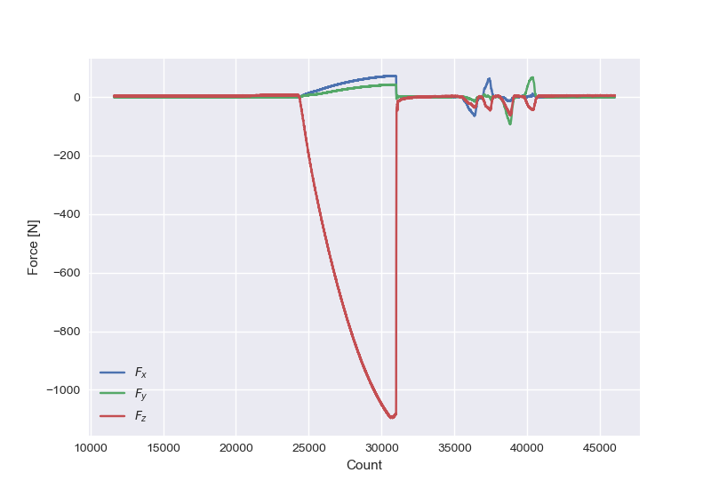

# `import optoforce`

A package which simplifies connecting to and reading from optoforce sensors, using Python

This is mainly here to accompany my [blog posts](https://alknemeyer.github.io/embedded-comms-with-python/) on communicating with embedded systems using python, where the optoforce sensor is an example. I hope this package is simple enough to serve as a template for others. I see that there are [other packages](https://github.com/search?q=optoforce) on GitHub which help with this

I don't imagine it'll have many users, since [the optoforce website](https://optoforce.com) redirects to another company which doesn't even mention them, and _that_ company's [optoforce page](https://www.robotshop.com/en/optoforce.html) is pretty blank. BUT I use one, so perhaps there are others?


## Installation

```bash
python -m pip install optoforce
```


## Usage

From a python script:

```python
# 16 byte frame/single-channel 3 axis force sensor (OMD-45-FH-2000N)
from optoforce import OptoForce16 as OptoForce
from optoforce.status import no_errors

with OptoForce(speed_hz=100, filter_hz=15, zero=False) as force_sensor:
    measurement = force_sensor.read(only_latest_data=False)
    assert measurement.valid_checksum
    assert no_errors(measurement.status)

    do_stuff_with_force_readings(measurement.Fx, measurement.Fy, measurement.Fz)
```

A call to `OptoForce.read()` returns a measurement packet (a NamedTuple) containing force readings and other potentially useful data. For the specifics of each sensor model, see `Reading16`, `Reading34` and `Reading22` in [`optoforce/reading.py`](./optoforce/reading.py). For example `OptoForce34` returns force readings as  `Fx1`, `Fy1`, `Fz1`, `Fx2`, ... (not `Fx`, `Fy`, `Fz`) as there are multiple channels

It's still a little verbose, so you may want to define shortcuts for your particular application. For example, if you don't care about anything except the vertical force:

```python
with OptoForce() as force_sensor:
    read_fz = lambda: force_sensor.read(only_latest_data=False).Fz
    while True:
        print(read_fz())
```

If you haven't read the force force sensor in a little while and want to get all the packets waiting in the buffer, use:

```python
measurements = force_sensor.read_all_packets_in_buffer()
```

Or from the command line, to log to a file:

```bash
$ python -m optoforce --filename force-data.csv
```

If you want to detect and handle sensor errors as reported in the status word, look at the doc string in [`optoforce/status.py`](./optoforce/status.py). It was written for completeness after I finished my use for the OptoForce, so it hasn't been tested!


## OptoForce models supported

_Possibly_,

* 16 byte frame/single-channel 3 axis force sensor (OMD-45-FH-2000N)
* 34 byte frame/multi-channel 3 axis force sensor (4 channels)
* 22 byte frame/single-channel 6 axis force/torque sensor

but I only have access to the 16 byte frame model, so I can't test the other two. The 34 byte model [has been reported to work too](https://github.com/alknemeyer/optoforce/issues/1). I imagine this means that the 22 byte model will be fine, but the torque readings aren't scaled as I don't have that datasheet :/


## Sources

`OptoForce General DAQ - USB,CAN,UART - v1.7.pdf` was used to implement this module

The force scale parameters are from `SensitivityReport-PFH0A052.pdf`

A friend mentioned that I might not be allowed to share those docs, since the company is quite secretive, and I unfortunately haven't seen them online


## Common bugs

If you get permission errors when trying to open the serial port and you run linux, try running the code below ([source](https://stackoverflow.com/questions/27858041/oserror-errno-13-permission-denied-dev-ttyacm0-using-pyserial-from-pyth))

```bash
$ sudo chmod 666 /dev/ttyACM0  # replace with your serial port
```

Permission errors [can also happen on Windows](https://github.com/alknemeyer/optoforce/issues/1) -- you'll know that's the case when you get an error which includes `Original message: PermissionError(...)`.  That can happen when [something else is using the device](https://stackoverflow.com/questions/59993883/pyserial-permissionerror13-access-denied-none-5/63922626#63922626). In that case, making sure no other program is connected to the device should work. You could do that by unplugging the sensor, and plugging it back in again.


## Developing

See [`python-template`](https://github.com/alknemeyer/python-template/) for some general tips on Python package development.

Run unit tests using `pytest`. You should see output similar to,

```bash
$ python -m pytest
======================================== test session starts ========================================
platform linux -- Python 3.9.6, pytest-6.2.4, py-1.10.0, pluggy-0.13.1
rootdir: /home/alex/dev/optoforce, configfile: pyproject.toml, testpaths: tests
collected 6 items                                                                                   

tests/test_all.py ......

========================================= 6 passed in 0.02s =========================================
```

If you have `matplotlib` installed, you can run a more visual test using

```bash
$ python test-plot.py
```



### Publishing a new version

Install [flit](https://flit.readthedocs.io/en/latest/), which makes publishing packages ridiculously easy. You can install it as part of your development environment, or in a base/systemwide environment, as it's just used for publishing but isn't a requirement of the package itself.

Next, increase the `__version__` number in [`optoforce/__init__.py`](optoforce/__init__.py). Then, create a (local) tag for the commit and publish:

```bash
# make a local tag of the current commit
$ git tag v0.0.1
# push local tag to remote repo
$ git push origin v0.0.1
# generate files into dist/ and upload them to pypi
$ flit publish
```
